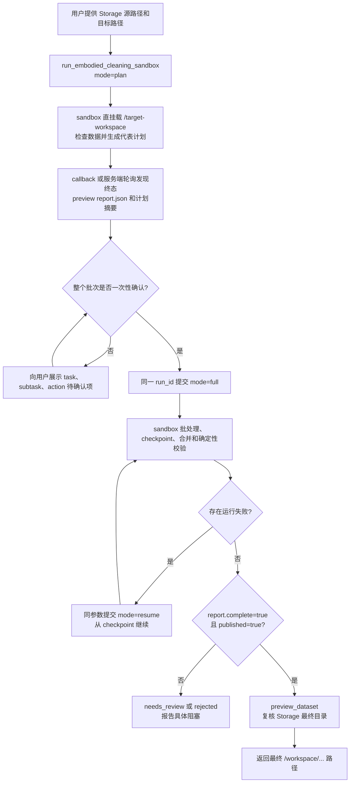

# 具身智能机器人数据清洗 Skill 流程说明

## 1. 文档目的

本文说明当前 `embodied-data-cleaning` Skill 如何把 Pyromind Storage 中的
S2 机器人自采数据清洗、对齐并转换为 LeRobotDataset v2.1，供前端测试、
数据验收和后续开发维护使用。

当前实现的重点是：

- 主要支持 S2 自采数据链路；
- 最终格式只输出 LeRobotDataset v2.1，不保留 v3 兼容分支；
- 原始数据只读，所有删除操作先记录为可逆计划；
- Agent 自动判断是否使用该 Skill，用户不需要说出 Skill 名称；
- Agent 只检查 sandbox 生成的一个代表计划，全量逐 episode 清洗由可恢复批处理内部完成；
- 整个批次使用一个用户确认的训练 task，颜色或形状 prompt 只作为目标元数据；
- 原始 payload、checkpoint 和最终数据集全程位于 Pyromind Storage 挂载目录，
  不进入 Agent 本地会话工作区；
- LLM 可以理解任务语义，但帧、时间戳、索引和格式必须由确定性工具校验。

## 2. 用户如何使用

用户只需要提供 Storage 源路径、目标格式和目标输出路径，例如：

```text
帮我清洗 /workspace/robot/20260729_170038，
输出 LeRobot v2.1，最终上传到
/workspace/robot/20260729_170038_lerobot_v21。
```

如果任务文本、subtask 范围或派生 action 语义需要确认，Agent 会在物化前
说明具体内容并请求确认。用户不需要输入“调用 embodied-data-cleaning”。

批量处理时也只需要提供源目录和目标目录，例如：

```text
清洗 /workspace/robot 下的全部自采 episode，统一任务为
Pick and place the item on the table，转换为 LeRobot v2.1，发布到
/workspace/robot/robot_lerobot_v21_cleaned。
```

Agent 会先提交 `mode=plan` 的 sandbox 作业，生成一个代表 episode 的计划摘要。
用户一次性确认 task、subtask 和派生 action 语义后，Agent 使用相同 `run_id`
提交 `mode=full`；sandbox 完成全部 episode 的清洗、校验和原子发布。代表 episode
不单独发布。

## 3. 输入数据

### 3.1 必需文件

一个自采 episode 至少需要：

```text
episode_root/
├── joints.jsonl
├── head.mp4
└── head.csv
```

| 文件 | 作用 |
|---|---|
| `joints.jsonl` | 机器人状态、末端执行器状态、吸盘状态和 subtask 标签 |
| `head.mp4` | 主 RGB 视频，也是输出帧数和 FPS 的权威来源 |
| `head.csv` | 主 RGB 每帧的传感器时间戳，用于与 joints、深度对齐 |

### 3.2 建议文件

| 文件 | 作用 |
|---|---|
| `manifest.json` | 任务执行阶段和弱语义信息；只作为 subtask 的后备来源 |
| `head_depth.u16` | 连续存储的原始 uint16 深度帧 |
| `head_depth.csv` | 深度帧传感器时间戳 |
| `head_depth_meta.json` | 深度宽高、编码和 `depth_scale` |

深度是可选流：完整且有效时纳入输出；为空或无效时省略，仍可产生合法的
RGB-only v2.1 数据集。Storage 中存在但因文件过大未被预览下载的深度文件，
状态应记录为 `not_materialized`，不能误判为无效。

### 3.3 `joints.jsonl` 的使用方式

每行代表一个状态采样。当前转换主要使用：

- `stamp_ns`：首选状态时钟；
- `joints`：固定顺序的 22 个机器人关节值；
- `left_ee_states[4]`：`left_grip_pos`；
- `right_ee_states[4]`：`right_grip_pos`；
- `suction_state`：保护吸取/释放边界，不写入固定 24 维向量；
- `subtask`：生成连续子任务区间；
- `wall_time`：只有传感器时间戳不可用时才作为后备时钟。

最终 `observation.state` 为 24 维：22 个固定顺序关节，加左右夹爪位置。
相机帧与 joints 行数不要求一致，工具会按传感器时间戳插值到 RGB 帧时间线。

## 4. 完整流程



## 5. 各阶段职责

### 5.1 Storage 预览与 sandbox 直挂载

`preview_dataset` 只用于 Agent 查看小型报告和最终目录，不下载原始视频、深度文件
或 Parquet payload。生产链路只向 Pyromind Agent 暴露一个具身清洗工具：
`run_embodied_cleaning_sandbox`。

该工具提交 `CustomCommandCPUNode`，节点中的 Storage 根目录为
`/target-workspace`。例如 Storage 路径 `/robot/raw` 在作业内映射为
`/target-workspace/robot/raw`。因此不再调用 `materialize_storage_files`，也不在
Terminal 或会话工作区中执行本地具身清洗工具。

`inspect_embodied_dataset`、`build_embodied_episode_plan`、
`batch_clean_le_robot_v21`、`validate_le_robot_v21` 和其他底层 API 仍保留给开发者
本地测试以及固定 sandbox runtime 内部使用，但不加入平台 Agent 默认工具集。

### 5.2 数据检查

`inspect_embodied_dataset` 自动识别自采格式，并返回：

- episode 数量与 ID；
- RGB、深度、state/action 流状态；
- 每种流的帧数、FPS 或错误原因；
- 最多 3 个代表 episode 的摘要。

流状态需区分：

- `available`：sandbox 挂载目录中存在且校验可用；
- `not_materialized`：Storage 已知存在，但尚未下载完整 payload；
- `missing`：源数据中不存在；
- `invalid`：空文件、大小不符或无法解析。

### 5.3 构建可逆清洗计划

`mode=plan` 作业生成：

```text
/.pyromind-agent/<conversation_id>/embodied_cleaning/<run_id>/
├── inspection.json
├── representative_plan.json
├── representative_plan.summary.md
├── plan_report.json
└── report.json
```

`episode_plan.json` 是审计和执行计划，不是训练数据。它记录：

- 原始流及状态；
- task 文本、来源和确认状态；
- subtask 半开区间 `[start_frame, end_frame)`；
- 建议删除的静止区间；
- 每个保留帧从原始索引到清洗索引的映射；
- joints 前后采样行及插值权重；
- 24 维 state/action 字段名称、单位和来源；
- action provenance；
- `accepted`、`needs_review` 或 `rejected` 质量结论。

### 5.4 静止帧清洗

默认参数为：

- 关节速度阈值：`0.02 rad/s`；
- 最短持续静止时间：`1.5 s`；
- 前后上下文保护：`0.5 s`。

只删除持续静止区间，并保护：

- subtask 开始和结束；
- `suction_state` 变化；
- 机器人运动开始和结束；
- 上下文缓冲帧。

所有区间使用半开表示。例如 `[89, 121)` 表示删除原始帧 89 到 120。
删除后重新生成从 0 开始、连续的 `clean_frame_index` 和
`clean_time_s = clean_frame_index / fps`。

### 5.5 Subtask 处理

来源优先级：

1. `joints.jsonl` 中连续的 `subtask`；
2. `manifest.json` 中的阶段记录；
3. 两者都缺失时才允许生成标签。

工具负责计算边界，Agent 负责判断语义是否合理。来源、置信度和用户确认状态
必须保留，不能因为把重叠区间裁平就把置信度写成 `1.0`。

### 5.6 多模态时间戳对齐

- MP4 帧数和 FPS 决定最终媒体时钟；
- 相机 CSV 只用于状态、subtask 和其他相机流的对齐；
- 首选 `stamp_ns`，其次使用 `stamp_sec + stamp_nsec`；
- 不用 `wall_time` 抖动判断真实丢帧；
- 不要求 joints、RGB 和深度的原始采样数量相同；
- 每个 RGB 帧独立映射 joints；
- 每个深度或次相机流按自己的时间戳独立匹配；
- 较慢流允许同一深度帧被多个 RGB 帧重复选择。

### 5.7 人工确认与计划终结

物化前必须明确：

- task 文本；
- source-derived subtask 范围；
- action 使用参考数据集的下一帧 state 语义。

批量链路内部使用与 `finalize_embodied_episode_plan` 相同的终结逻辑，不信任 JSON
中手工写入的 `accepted`。它会重新读取原文件，重建 streams、segments、feature
schema 和 timeline mapping，再应用经过确认的 task 与 drop intervals。只有重新
计算后仍满足质量门，才写出：

```text
episode_plan.accepted.json
episode_plan.accepted.summary.md
```

### 5.8 LeRobot v2.1 物化

批处理内部使用与 `materialize_le_robot_v21` 相同的物化逻辑，生成单 episode 的
标准目录并立即校验。独立工具继续保留用于单 episode 调试：

```text
dataset_root/
├── meta/
│   ├── info.json
│   ├── episodes.jsonl
│   ├── episodes_stats.jsonl
│   └── tasks.jsonl
├── data/chunk-000/
│   └── episode_000000.parquet
└── videos/chunk-000/
    ├── observation.images.head/
    │   └── episode_000000.mp4
    └── observation.images.head_depth/
        └── episode_000000.mp4
```

深度无效时，不创建 `observation.images.head_depth`。

Parquet 固定列顺序为：

1. `observation.state`：24 维 `float32`；
2. `action`：24 维 `float32`；
3. `timestamp`：`frame_index / fps`；
4. `frame_index`：episode 内从 0 连续递增；
5. `episode_index`；
6. `index`：数据集全局连续索引；
7. `task_index`。

Action 采用参考 case 的约定：

```text
action[t] = observation.state[t + 1]
action[last] = observation.state[last]
```

这是派生目标，不等同于机器人真实控制命令。

有效的 `.u16` 深度会按 `depth_scale` 转为米，裁剪到 3 米，应用 JET 色图，
再写成 3 通道 MP4，并在 `info.json` 中记录
`s2_depth_video_colormap: "jet"`。

### 5.9 可恢复 sandbox 批量清洗与统一 task

用户完成一次数据集级确认后，Agent 使用 plan 返回的 `run_id` 提交一次
`run_embodied_cleaning_sandbox(mode="full")`。固定 runtime 内部只调用一次
`batch_clean_le_robot_v21`。Agent 不再逐 episode 调用 build、finalize、
materialize 和 validate，也不再用 Terminal 扫描 joints 文件。

批处理工具内部执行：

- 枚举全部 episode，并确定性记录发现数；
- 为每段数据构建和终结可逆计划；
- 将 `accepted`、`needs_review`、`rejected` 和运行 `failed` 分开统计；
- 只物化 accepted episode，materialize 内部完成单集校验；
- 每完成一个 episode 原子写入 `batch_checkpoint.json`；
- 将详细计划、错误和警告写入 `batch_report.json`，工具 Observation 只返回简短统计；
- 没有运行失败时，自动合并所有 accepted episode。

质量门拒绝是完整的处理结论，不会阻断其他 episode。意外异常计为 `failed`，此时
不生成可发布的最终目录。修复原因后使用完全相同的参数和 `run_id` 提交
`mode="resume"`，工具跳过已经 accepted、needs_review 或 rejected 的 episode，
只重试 failed 项。

合并工具会确定性执行：

- 校验每个输入目录都是有效且只包含一个 episode 的 v2.1 数据集；
- 检查 `codebase_version`、`robot_type`、FPS、feature schema、chunk 大小和
  深度编码配置兼容；
- 按输入顺序从 0 重新生成 `episode_index`；
- 重新生成数据集级连续 `index`，保留每个 episode 内的连续 `frame_index`；
- 复制 RGB 和可选深度视频到正确的 chunk 目录；
- 重建 `info.json`、`episodes.jsonl`、`episodes_stats.jsonl` 和 `tasks.jsonl`；
- 将所有 episode 的 `task_index` 统一为 0；
- 在临时目录完成整体校验后再生成最终目录，避免留下看似完整的半成品。

参考数据集的 37 个 episode 共用一个 task。因此当前 S2 批量链路也使用一个
用户确认的数据集级任务，例如：

```text
Pick and place the item on the table
```

`golden rectangle`、`blue rectangle` 等 manifest prompt 只描述目标颜色或形状，
不能自动拆成不同训练任务。批处理成功时返回实际发现、接受、复核、拒绝、失败、
frame 和 video 数量，并提供 checkpoint 与 report 路径。

### 5.10 sandbox 内确定性校验

`validate_le_robot_v21` 检查：

- `codebase_version` 必须为 `v2.1`；
- metadata 文件齐全且 JSON/JSONL 可解析；
- episode、task、frame、video 总数一致；
- Parquet 列名、顺序、类型和行数正确；
- state/action 均为 24 维且值有效；
- action 严格满足 next-state 规则；
- timestamp、frame index 和 global index 连续；
- `episodes_stats.jsonl` 与 Parquet 重算统计一致；
- 所有 MP4 帧数、FPS、宽高与 metadata、Parquet 一致；
- S2 feature 名称和顺序与参考 case 完全一致。

最终要求：

```text
valid = true
structurally_valid = true
reference_profile_valid = true
errors = []
```

### 5.11 Storage 内原子发布与复核

sandbox 先在 run 目录生成并校验合并数据集，只有校验通过后才复制到目标目录对应的
临时路径，再以目录替换完成发布。目标已存在时，只有内容 SHA-256 完全一致才视为
幂等成功；否则拒绝覆盖，避免破坏已有数据。

callback 唤醒会话后，Agent 必须先查看 `output_dir/report.json`，再调用
`preview_dataset(mode="inspect")` 检查目标目录。只有同时满足以下条件才允许向
用户报告“清洗完成”：

```text
report.complete = true
report.published = true
report.validation.valid = true
Storage 文件列表复核成功
```

最终对用户返回的是 `/workspace/...` 平台路径；报告中的路径也使用 Storage 逻辑
路径，不泄露 sandbox 内部的 `/target-workspace` 前缀。

Kafka callback 是任务终态通知的主通道。agent-server 同时对当前已加载会话中的
具身清洗任务调用 Studio `get_task` 轮询作为兜底；默认间隔为 10 秒，可通过
`PYROMIND_WORKFLOW_TASK_POLL_INTERVAL_SECONDS` 调整。轮询发现终态后仍进入同一个
callback 收口逻辑，确保重复通知只处理一次、移除 `active_long_tasks`、向前端发布
最终状态，并自动继续 Agent。因此 Kafka 暂时不可达时，任务也不会长期停留在
`Running`。

### 5.12 长会话与模型异常恢复

批量清洗会产生较多工具事件。平台侧新增了两项运行可靠性处理：

- 对 GLM-5.2，未显式配置时使用 1,000,000 token 输入窗口，并在窗口的 75%
  触发 token 驱动的上下文压缩；Pyromind 会话不再因为固定 240 个事件而过早压缩；
- LiteLLM 或模型供应商返回 `Unable to get json response` 时，将其转换为可重试的
  `LLMServiceUnavailableError`，同步和异步调用都复用现有有界重试策略。

这只提高会话稳定性，不参与帧对齐或格式判断，也不表示可以无限重试。超过现有
重试上限后仍会返回原始故障，避免清洗任务无休止运行。

## 6. 质量状态

### `accepted`

必需流可解析、时间轴映射完整、索引连续、边界受保护、字段来源明确，且任务、
subtask 和派生 action 语义已确认。只有该状态可以物化。

### `needs_review`

数据可以恢复或需要人为决定，例如：

- task 为空或只是目录名；
- subtask 范围尚未确认；
- 派生 action 尚未确认；
- 可选深度流无效，将降级为 RGB-only；
- 大文件仍为 `not_materialized`；
- 少量末端执行器数据需要可解释的时间戳插值。

源 manifest 同时出现 `status=stopped` 和 `dataset_eligible=true` 时，不按
`stopped` 一刀切拒绝。若 episode 缺少完整任务的结束阶段，应在质量报告中标记
为 partial 警告，由训练数据策略决定是否排除。

### `rejected`

存在不可安全转换的问题，例如：

- 必需文件无法解析；
- subtask 区间非法或无法消除重叠；
- RGB 帧无法在容差内映射到 state；
- 映射不单调或丢失吸盘/动作边界；
- 清洗后 timestamp 与 frame index 不一致。

`needs_review` 不是失败；`rejected` 也不能通过手工编辑 JSON 绕过。

## 7. 当前 case 示例

### 7.1 单 episode

`20260729_170038` 的实际处理结果：

| 项目 | 原始 | 清洗后 |
|---|---:|---:|
| RGB 帧 | 668 | 566 |
| joints 行 | 1545 | 对齐为 566 个 state |
| 深度帧 | 668 | 566 |
| state/action 维度 | 原始字段 | 24 / 24 |
| 视频 FPS | 30 | 30 |

该 case 删除 102 个持续静止帧。最终 Parquet、RGB 和深度视频均为 566 帧；
`action[t]` 与下一帧 state 的最大误差为 0，原文件重新对齐后的 state 与 Parquet
最大误差也为 0。

### 7.2 批量基线结果

部署本轮新增代码之前，旧版本 Agent 曾完成一次批量处理。该结果可以证明生成的
数据目录有效，但不能作为本轮新工具和新策略的端到端验证。

按当次工作区中实际可核对的源文件统计：

| 项目 | 数量 |
|---|---:|
| 发现的原始 episode | 13 |
| 进入最终数据集 | 9 |
| 被质量门拒绝 | 4 |
| 最终帧数 | 5162 |
| 最终视频数 | 18 |
| 最终 task 数 | 1 |

9 个已接受 episode 的源 RGB 共 5868 帧，清洗后为 5162 帧，删除 706 帧，
约占 12%。其中一个源 episode 的 `status=stopped`，但
`dataset_eligible=true`，因此被保留；它应作为 partial episode 提示，而不是由
转换器擅自拒绝。

4 个 rejected episode 是：

- `20260729_170958`：相机首帧早于 state 覆盖；
- `20260729_171107`：相机首帧早于 state 覆盖；
- `20260729_171224`：一个相机帧落入约 0.104 秒的 state 间隙；
- `20260729_171451`：相机首帧早于 state 覆盖。

旧回复曾把源数据错误汇报为 17 段，但实际为 `9 + 4 = 13` 段。最终汇报必须
分别从数据检查、逐 episode 质量结果和 merge 返回值读取发现数、接受数、拒绝数
和最终输出数，不能由 Agent 根据对话自行猜测。

## 8. 最终 Agent 回复应包含什么

成功时至少返回：

- Storage 最终路径，例如
  `/workspace/robot/20260729_170038_lerobot_v21`；
- 源 episode 总数、accepted 数、rejected 数及对应 ID；
- `valid`、episode 数、frame 数和 video 数；
- 是否包含深度，或省略了哪些可选流；
- task 文本；
- action provenance 为 `derived/next_state`；
- sandbox `run_id` 和固定 runtime revision；
- 必要的非阻塞警告；
- Storage 中的 report/checkpoint 路径。

失败时至少返回：

- 当前停在哪个阶段；
- 是 `needs_review`、`rejected`、运行失败，还是原子发布被拒绝；
- 具体文件、帧区间或字段；
- 用户需要确认的最小信息；
- 可以安全重试的下一步。

## 9. 当前能力边界

- 当前生产主链路是 S2 自采数据；Agent 只编排 sandbox plan、full/resume 和最终
  Storage 复核，不再逐 episode 往返；
- 当前只输出 v2.1；
- sandbox 依赖平台将 Storage 挂载到 `/target-workspace`，不支持没有该挂载的执行环境；
- 服务端必须配置版本固定的 runtime，推荐
  `PYROMIND_EMBODIED_RUNTIME_WHEEL_PATH`，也可使用精确版本的
  `PYROMIND_EMBODIED_RUNTIME_PACKAGE`；未配置时工具会拒绝提交；
- 主项目继续使用 Python 3.12；sandbox 安装独立的
  `openhands-embodied-runtime` wheel，并使用 Python 3.10 执行。该 wheel 只包含
  确定性清洗、校验和发布逻辑，不依赖 OpenHands SDK 或浏览器工具；
- Agent 不能上传临时脚本替代固定 runtime，也不能将原始 payload 拉入本地会话目录；
- action 是用户确认的 `derived/next_state`，不是录制的控制指令；
- `suction_state` 用于边界证据，但不进入固定 24 维向量；
- MP4 FPS 是输出时钟，不保留相机 CSV 的真实不均匀播放间隔；
- 语义模型可以辅助理解 pick/place，但不能替代确定性格式和时间轴校验；
- 代表 episode 只用于一次性确认，不物化或上传独立样本数据集。

## 10. 实现位置

| 内容 | 路径 |
|---|---|
| Skill 主流程 | `.agents/skills/embodied-data-cleaning/SKILL.md` |
| 输入格式规范 | `.agents/skills/embodied-data-cleaning/references/source-formats.md` |
| 质量门 | `.agents/skills/embodied-data-cleaning/references/quality-gates.md` |
| v2.1 输出规范 | `.agents/skills/embodied-data-cleaning/references/lerobot-v21.md` |
| Agent 工具定义 | `openhands-tools/openhands/tools/embodied_data/definition.py` |
| Python 3.10 sandbox runtime | `openhands-embodied-runtime/openhands_embodied_runtime/` |
| 数据适配与检查 | `openhands-embodied-runtime/openhands_embodied_runtime/adapters.py` |
| 清洗计划 | `openhands-embodied-runtime/openhands_embodied_runtime/planning.py` |
| 批量清洗与 checkpoint | `openhands-embodied-runtime/openhands_embodied_runtime/batch.py` |
| v2.1 物化与校验 | `openhands-embodied-runtime/openhands_embodied_runtime/lerobot_v21.py` |
| sandbox 提交工具与任务关联 | `openhands-tools/openhands/tools/embodied_data/platform_submit.py` |
| sandbox 固定运行入口 | `openhands-embodied-runtime/openhands_embodied_runtime/sandbox_runner.py` |
| 平台工具注入 | `openhands-agent-server/openhands/agent_server/pyromind_router.py` |
| LiteLLM 异常映射 | `openhands-sdk/openhands/sdk/llm/llm.py` |
| 长会话压缩 | `openhands-sdk/openhands/sdk/context/condenser/llm_summarizing_condenser.py` |

## 11. 本轮改动部署后的验收

旧版本生成的 9 episode 数据集通过校验，只能作为基线。部署本轮改动后，应使用
全新会话和新的目标目录重新执行一次，至少确认：

- `run_embodied_cleaning_sandbox` 可调用，旧的本地具身清洗工具不在 Agent 默认工具集；
- `mode=plan` 的任务在 sandbox 读取 Storage，Agent 本地不出现原始视频、深度或
  Parquet payload；
- plan/full 使用同一个 `run_id`，报告记录服务端配置的 `runtime_revision`；
- 源 episode 数来自实际检查结果，不能再次把 13 段汇报为 17 段；
- accepted 与 rejected episode 的数量、ID 和原因完整；
- 中断后使用 `mode=resume` 只重试 failed episode，不重新处理已完成项；
- 合并结果只有一个确认 task，且不把颜色 prompt 拆成多个 task；
- 合并后的 episode、frame、video 数与工具返回和 metadata 完全一致；
- `report.validation.valid=true`；
- `report.complete=true` 且 `report.published=true`；
- Storage 最终文件列表与报告中的统计一致；
- 模型偶发返回非法 JSON 时会有限重试，而不是立即终止整个会话。

建议使用新的目标目录，例如：

```text
/workspace/robot/robot_lerobot_v21_cleaned_v2
```
