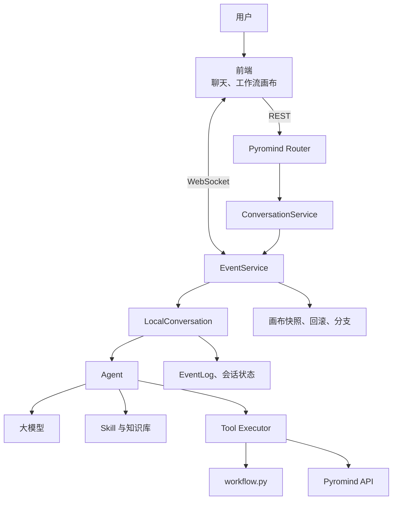
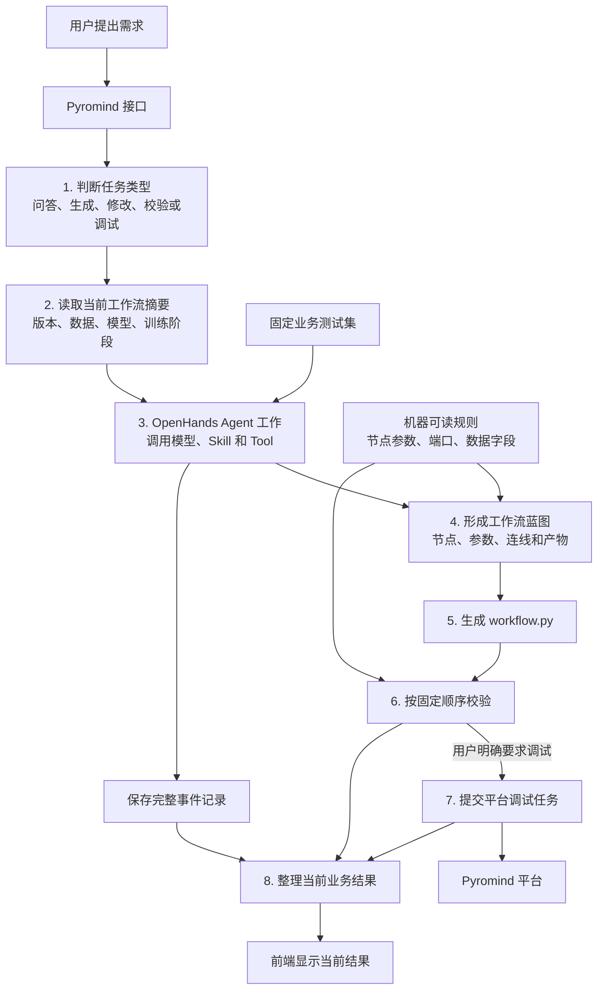

# Pyromind Harness 架构分析与扩展建议

> 更新时间：2026-07-24  
> 范围：`software-agent-sdk` 的 Pyromind 定制链路、`minimal-chat-frontend`，以及本地 `codex-main` 中少量可参考的设计。

## 结论

当前项目已经有一套完整的 Agent Harness：它能保存会话、调用模型、执行工具、读取 Skill、恢复上下文、推送事件，也能保存和回滚工作流版本。

现在真正缺少的不是另一个 Agent 框架，而是 **训练工作流业务层**。目前很多业务判断仍然交给大模型通过 Prompt 临时完成，例如：

- 这次请求到底是问答、生成、修改、校验还是调试？
- 当前画布里已经有哪些数据、模型和训练阶段？
- 数据字段能不能接到某个训练节点？
- SFT 的输出有没有正确接到 DPO？
- 工作流是只生成了，还是已经校验或调试成功？
- 异步调试任务刷新页面后应该怎样恢复？

这些问题不能长期只依赖 Prompt。建议保留 OpenHands 的会话和工具内核，再补充几项业务能力：

1. 先判断用户这次要问问题、改工作流、校验还是调试。
2. 保存一份当前工作流摘要，避免模型每轮重新理解完整代码。
3. 先生成节点和连线清单，再生成 `workflow.py`。
4. 把节点参数、端口和数据字段要求保存成程序可以直接检查的规则。
5. 固定校验顺序，并限制自动修复次数。
6. 单独保存 Debug、数据清洗等平台任务的状态。
7. 给前端直接提供“当前工作流、校验结果、活跃任务”等最新状态。
8. 用一组固定业务题目持续测试 Agent 是否真的变好。

TODO 只是第 7 项中的一个小状态，不是整个 Harness 的中心。

本文中的几个常用词可以这样理解：

| 名称 | 通俗解释 |
|---|---|
| Harness | 负责让模型不断调用工具、读取结果并继续工作的运行底座 |
| DSL | 当前项目中的 `workflow.py` 工作流代码 |
| WorkflowSpec | 生成代码前的“节点、参数和连线清单”，类似工作流蓝图 |
| 契约 | 程序可以直接检查的规则，例如参数范围、端口类型和必需数据字段 |
| 业务状态投影 | 从完整事件历史中整理出来的“当前状态摘要”，类似仪表盘 |

---

## 问题一：当前 Harness 架构

### 1. 产品定位

这个项目是一个 **Pyromind 训练工作流助手**。

用户用自然语言提出需求，Agent 帮助完成：

- SFT、DPO、GRPO、LoRA、Benchmark 等工作流生成。
- 修改已有画布中的模型、数据、参数和连接。
- 数据预览、字段判断和格式检查。
- 工作流 DSL 校验和测试运行。
- Pyromind 平台与节点知识查询。

它不是正式训练调度器。当前正式训练工具没有直接开放给 Agent，这个边界应该继续保留。

### 2. 当前调用关系

下面这张图描述的是当前已经运行起来的流程：前端把消息交给 Agent，Agent 调用模型、Skill 和 Tool，最终修改工作流或调用 Pyromind 平台。EventLog 可以理解成会话的完整操作记录。



### 3. 当前模块职责

| 模块 | 主要文件 | 作用 |
|---|---|---|
| Pyromind API | [`pyromind_router.py`](../openhands-agent-server/openhands/agent_server/pyromind_router.py) | 创建会话，组合 Prompt、Tool、Skill、鉴权和画布上下文 |
| 会话管理 | [`conversation_service.py`](../openhands-agent-server/openhands/agent_server/conversation_service.py) | 创建、恢复、查找和隔离会话 |
| 事件服务 | [`event_service.py`](../openhands-agent-server/openhands/agent_server/event_service.py) | 后台运行 Agent，通过 WebSocket 推送事件和状态 |
| Harness 循环 | [`local_conversation.py`](../openhands-sdk/openhands/sdk/conversation/impl/local_conversation.py) | 让模型多轮调用工具，并处理暂停、中断、确认和死循环检测 |
| Agent | [`agent.py`](../openhands-sdk/openhands/sdk/agent/agent.py) | 调用模型、解析 Tool Call、执行工具 |
| 状态 | [`state.py`](../openhands-sdk/openhands/sdk/conversation/state.py) | 保存完整事件记录、执行状态、密钥和 Agent 运行数据 |
| Tool 框架 | [`tool.py`](../openhands-sdk/openhands/sdk/tool/tool.py) | 定义工具输入、输出和执行器 |
| 系统提示词 | [`system_prompt_codex.j2`](../openhands-sdk/openhands/sdk/agent/prompts/system_prompt_codex.j2) | 规定编辑、工具使用和回答方式 |
| Skill | [`.agents/skills`](../.agents/skills) | 规定生成和调试工作流时应遵循的业务步骤 |
| 知识库 | [`knowledge`](../knowledge) | 保存节点、平台、数据和训练文档 |
| 工作流版本 | [`workflow_canvas_store.py`](../openhands-agent-server/openhands/agent_server/workflow_canvas_store.py) | 保存输入/输出快照，支持回滚和分支 |

### 4. 当前已经具备的能力

- 每个会话有独立工作区和持久化状态。
- Agent 可以连续多轮调用工具。
- 工具调用和工具结果可以通过 ID 正确配对。
- Skill 说明和它引用的资料可以按需读取。
- 历史过长时可以压缩上下文。
- 有确认策略、Secret 管理和路径限制。
- 工作流可以从画布同步到 DSL，也可以从 DSL 返回画布。
- 工作流有版本、回滚和分支。
- 数据预览已经返回字段、样例、行数等结构化信息。
- DSL 校验已经能返回错误、警告、出错节点、出错字段和失败阶段。
- Debug 工具已经能返回任务 ID、运行状态、尝试次数和错误日志。

最后三项很重要：很多后端结构已经存在，当前更需要的是把它们串成稳定的业务流程，并在前端正确使用，而不是重新实现同样的 Tool。

### 5. 当前主要缺口

- 没有独立的请求识别模块，主要依靠 Prompt 判断应该调用哪个 Skill。
- 没有统一保存“当前工作流业务信息”，每轮经常重新读取完整 DSL。
- 大模型直接生成 Python DSL，中间没有一份可以先检查的“节点和连线清单”。
- 节点参数、端口、数据格式主要保存在 Markdown 中，不方便程序直接校验。
- 已有校验工具，但缺少统一的校验顺序、修复次数和停止条件。
- 异步 Debug/清洗状态存在 Tool 和 Callback 中，但没有统一任务中心。
- 完整事件记录已经存在，但前端还要从大量工具事件中猜“当前工作流到底是什么状态”。
- 有通用日志和测试，但缺少针对 SFT/DPO 工作流生成质量的系统评测。
- `pyromind_router.py` 承担过多装配工作，新增业务能力会继续膨胀。

---

## 问题二：针对当前业务，建议增加哪些 Harness 模块

### 1. 建议的目标架构



这张图可以用一句话概括：

> 先弄清用户要做什么和当前画布有什么，再让 Agent 生成工作流；生成后按固定顺序检查，最后把整理好的结果交给前端。

现有和新增部分的关系如下：

| 部分 | 当前情况 |
|---|---|
| OpenHands Agent、模型、Skill、Tool、完整事件记录 | 已经存在，继续使用 |
| 数据预览、DSL 校验、Debug Tool | 已经存在，继续使用 |
| 任务类型判断 | 建议新增 |
| 当前工作流摘要 | 建议新增 |
| 工作流蓝图和代码生成 | 建议分阶段新增 |
| 节点/端口/数据规则 | 建议新增机器可读版本 |
| 当前结果整理和固定业务测试集 | 建议新增 |

以“给现有 SFT 工作流增加 DPO 并测试”为例，系统应该按下面的顺序工作：

1. 判断这是“修改 + 校验 + 调试”，不是正式训练。
2. 读取当前版本，确认已有 SFT 节点、数据和模型输出。
3. 形成新增 DPO 节点及连接方式的清单。
4. 检查 DPO 数据是否包含 prompt/chosen/rejected 字段。
5. 生成 `workflow.py`，再调用现有校验工具。
6. 校验通过并且用户确实要求测试时，才提交 Debug。
7. 前端显示“修改成功、校验结果、Debug 任务状态”，而不是平铺所有 Tool 日志。

### 2. 先判断用户这次要做什么

#### 解决什么问题

当前主要通过 Prompt 和 Skill 描述让模型判断任务类型。简单请求通常没问题，但短指令容易混淆，例如：

- “换个模型跑一下”既包含修改，也可能包含调试。
- “看下这个数据”可能是知识问答，也可能需要真实预览 Storage。
- “测试一下”应该调用 debug，而不是正式运行。

如果判断错了，后面的 Skill 和 Tool 都会走错。

#### 系统判断后保存什么

```json
{
  "intent": "modify_workflow",
  "sub_intents": ["change_model", "validate"],
  "requires_current_workflow": true,
  "requires_dataset_preview": false,
  "allowed_actions": ["read", "edit", "validate"],
  "forbidden_actions": ["formal_run"],
  "needs_user_confirmation": false
}
```

这些字段分别表示：主要任务、附带任务、是否需要当前工作流、是否需要预览数据、允许和禁止的操作，以及是否需要用户确认。后面的 Agent 和 Tool 只需要按照这张任务说明单工作。

#### 怎么实现

先用规则处理边界清楚的请求，不需要一开始再调用一个 LLM：

- 明确的“测试/调试/试跑”进入测试流程。
- 明确的“生成/修改/换模型/改参数”进入工作流编辑流程。
- 明确的“正式训练/启动训练”进入需要用户确认的正式训练流程。
- 其他请求交给现有 Skill 匹配。

判断结果直接交给本轮 Agent，用来选择 Skill、限制可调用的 Tool，并决定是否必须读取当前 workflow。

也就是说，这个模块不负责完成任务，只负责给后续 Agent 一张简单的任务说明单，避免 Agent 一开始就走错方向。

#### 推荐位置

新增 `pyromind/intent_router.py`，由 `send_pyromind_message()` 在消息进入 Agent 前调用。

### 3. 保存一份“当前工作流摘要”

#### 解决什么问题

当前 Agent 每轮需要重新读取 `workflow.py`，然后从 Python 代码中理解：

- 使用了哪些数据集和模型。
- 有哪些训练阶段。
- 节点之间怎样连接。
- 上一轮是否已经校验或调试。

长工作流会浪费上下文，也容易遗漏已有信息。

#### 摘要里保存什么

代码中可以把这份摘要命名为 `CurrentWorkflowState`。它不是另一份工作流文件，只是从当前 `workflow.py` 提取出来的简要信息。

```json
{
  "version_id": "v15",
  "workflow_path": "public_data/workflow_canvas/workflow.py",
  "datasets": ["pyromind/self-cognition"],
  "models": ["Qwen/Qwen3-4B"],
  "stages": ["sft", "dpo", "benchmark"],
  "artifacts": {
    "sft_model": "sft.output_path",
    "dpo_model": "dpo.output_path"
  },
  "validation_status": "passed",
  "debug_status": "not_run"
}
```

#### 怎么实现

- 画布同步或 workflow 文件修改后，重新提取一次摘要。
- 把摘要保存到 `agent_state.current_workflow`。
- 每轮先把摘要给模型；只有真正要修改或检查细节时才读取完整文件。
- 摘要必须带 `version_id`，避免使用旧上下文。

这会减少重复读取，也能让“换个模型”“加一个评测”等短指令更可靠。

#### 推荐位置

新增 `pyromind/current_workflow.py`，在画布输入同步和工作流输出事件生成时更新。

### 4. 先做“工作流蓝图”，再生成代码

#### 解决什么问题

当前流程基本是：自然语言 + 文档 → 大模型直接写 Python DSL。

这种方式灵活，但质量很依赖模型：

- 节点名可能正确，但端口连接错误。
- SFT 输出可能没有正确绑定到 DPO 输入。
- 参数组合分别合法，放在一起却不合理。
- 修改一个节点时可能误改其他部分。

#### 工作流蓝图长什么样

```json
{
  "name": "sft_dpo_pipeline",
  "nodes": [
    {
      "id": "sft",
      "type": "SFTTrainingNode",
      "params": {
        "model": "Qwen/Qwen3-4B",
        "dataset": "pyromind/self-cognition"
      }
    },
    {
      "id": "dpo",
      "type": "DPOTrainingNode",
      "params": {
        "dataset": "pyromind/alpaca-gpt4-llm-demo"
      }
    }
  ],
  "bindings": [
    {
      "from": "sft.model_output_path",
      "to": "dpo.model_input"
    }
  ]
}
```

这份 JSON 就是 `WorkflowSpec`。可以把它理解成施工前的图纸：先列清楚有哪些节点、参数是什么、节点怎样连接，再由程序生成 Python DSL。这样很多错误可以在写文件之前发现。

#### 不建议一次性替换现有 DSL

分两步做更稳妥：

1. 第一阶段继续让模型生成 `workflow.py`，同时生成一份 `workflow_manifest.json` 节点清单，用来核对节点、连接、数据和产物。
2. 第二阶段再让程序根据节点清单自动生成常用系统节点代码；自定义 Python 节点仍允许直接写 DSL。

这样不会因为引入 Spec 而失去当前 DSL 的灵活性。

#### 推荐位置

新增：

```text
pyromind/workflow_spec/models.py
pyromind/workflow_spec/extractor.py
pyromind/workflow_spec/compiler.py
```

### 5. 把节点、端口和数据要求做成规则表

#### 解决什么问题

现在很多确定信息存在 `knowledge/nodes` 和 Skill Reference 的 Markdown 中。Markdown 适合模型阅读，但不适合程序稳定判断：

- 节点有哪些必填参数。
- 参数类型和取值范围是什么。
- 输入输出端口叫什么。
- 哪种输出可以连接到哪种输入。
- SFT/DPO 数据需要哪些字段。

#### 规则表长什么样

```json
{
  "node_type": "DPOTrainingNode",
  "version": "1",
  "required_params": ["dataset", "model"],
  "params": {
    "beta": {"type": "number", "min": 0, "default": 0.1}
  },
  "inputs": {
    "model_input": {"type": "model_path"}
  },
  "outputs": {
    "model_output_path": {"type": "model_path"}
  },
  "dataset_contract": {
    "required_fields": ["prompt", "chosen", "rejected"]
  }
}
```

#### 怎么使用

- 生成工作流蓝图时检查节点和连接。
- 数据预览后直接判断字段是否满足 SFT/DPO 要求。
- 参数选择时返回默认值、范围和来源。
- 前端参数面板和错误提示也读取同一份规则。

知识文章仍然保留，用来解释“为什么这样设计”；确定的参数、端口和字段要求则保存成 JSON 或其他机器可读格式，让程序可以直接检查。

#### 推荐位置

新增 `pyromind/contracts/`。这些规则最好从平台节点定义或 SDK 中已有的字段定义自动生成，避免文档写一份、代码再手工写一份，最后两边不一致。

### 6. 固定校验顺序和自动修复次数

#### 当前基础

现有 `validate_workflow_dsl` 已经做得比较完整，能返回：

- DSL 解析错误。
- SDK 定义不匹配。
- 平台规则不匹配。
- node_id、node_type、field、edge_id。
- 是否值得重试，以及错误发生在哪个阶段。

所以不需要再造一个校验工具，只需要增加一个负责“按什么顺序检查、失败后是否修复、什么时候停止”的控制模块。

#### 建议校验顺序

```text
需求完整性
  -> 数据字段要求
  -> 工作流蓝图结构
  -> 节点与端口连接
  -> DSL 生成
  -> 现有 validate_workflow_dsl
  -> 用户明确要求时 workflow_debug
```

#### 修复控制

- 确定性错误先在本地修复，不重复请求平台。
- `retryable=false` 的 401、参数错误不能盲目重试。
- 自动修复设置最大次数，例如 2 次。
- 每次修复只改与错误相关的节点或连接。
- 超过次数后停止，让用户看到清楚的剩余错误。

#### 推荐位置

新增 `pyromind/validation_orchestrator.py`，负责串起现有检查工具，不改变底层验证 API。

### 7. 单独管理长时间运行的平台任务

#### 当前基础

Debug Tool 已经返回任务 ID、状态和尝试次数，平台完成后也能通过回调恢复会话。问题是这些信息还散在工具结果、临时任务存储和回调代码中，没有一处能够直接查询完整任务状态。

#### 建议增加统一任务状态

```json
{
  "task_id": "T1234",
  "task_type": "workflow_debug",
  "conversation_id": "...",
  "workflow_version_id": "v15",
  "status": "running",
  "attempt": 1,
  "retryable": true,
  "error_summary": null
}
```

统一管理：

- Debug。
- 数据清洗。
- 文件上传等长时间任务。
- 以后经过用户确认的正式训练。

模块负责提交、保存、取消、超时和恢复任务。同一条平台回调即使重复发送两次，也只能处理一次，避免 Agent 被重复唤醒。

这里需要区分两个状态：聊天会话的状态表示 Agent 是否还在思考；平台任务的状态表示 Debug 或清洗是否还在运行。Agent 暂时结束回答，并不代表平台任务已经结束。

#### 推荐位置

可以在现有 task store 和 debug broker 基础上增加 `pyromind/domain_tasks/`，不要平行再建一套完全独立的队列。

### 8. 给前端准备一份“当前状态摘要”

#### 解决什么问题

底层 EventLog 像一本完整流水账，适合追溯每次模型回答、工具调用和工具结果。但前端不应该每次翻完整本流水账，才能知道当前工作流是否已经生成、校验或调试。

建议从事件中维护几个当前状态：

```json
{
  "current_intent": {},
  "current_workflow": {},
  "workflow_result": {},
  "active_tasks": [],
  "current_plan": {}
}
```

这份 JSON 就是“业务状态投影”，也可以直接理解成前端仪表盘的数据。其中 `current_plan` 只是一个字段，更重要的是当前工作流、最终结果和仍在运行的平台任务。

#### 工作流结果摘要

```json
{
  "workflow_version_id": "v15",
  "generation": "created",
  "validation": "failed",
  "debug": "not_requested",
  "formal_run": "not_started"
}
```

这些字段分别表示：工作流文件是否生成、校验是否通过、是否完成 Debug、是否启动正式训练。字段使用英文是为了方便前后端传输，页面应该显示中文。

前端可以直接展示：

```text
工作流文件    已生成
DSL 校验      未通过
Debug         未执行
正式训练      未启动
```

#### 怎么实现

- 完整事件记录继续保留，用于排查和恢复。
- 在 `agent_state` 或单独状态文件中保存最新业务摘要。
- WebSocket 连接时直接发送这份摘要。
- 前端收到后直接更新页面，不重新扫描全部历史。

#### 推荐位置

新增 `pyromind/projections.py`，由 EventService 在关键业务事件后更新。

### 9. 用固定业务题目持续测试 Agent

#### 解决什么问题

当前有普通单元测试和模型调用日志，但还不能系统回答：

- 换一个模型后，SFT+DPO 工作流质量变好还是变差？
- 哪类请求最容易选错 Skill？
- 哪些节点和连接最容易校验失败？
- 数据字段判断错误主要发生在哪里？
- Prompt 或 Tool 改动是否造成回归？

#### 建议建立评测集

评测场景至少包括：

- 从空画布生成 SFT。
- 生成 SFT+DPO，并检查产物连接。
- 生成 GRPO+Reward。
- 给已有工作流更换模型。
- 修改单个参数，不破坏其他节点。
- 数据字段不满足 DPO 时给出正确提示。
- 校验返回 401 时不重复调用。
- Debug 失败后按节点错误局部修复。
- 用户在 Agent 运行期间修改画布时发现版本冲突。

#### 评分内容

- 意图和 Skill 是否选对。
- 是否读取了必要信息，有没有无关检索。
- 节点、参数、端口和数据字段是否正确。
- 产物路径是否完整闭合。
- 是否通过 DSL 校验。
- 是否误触发 Debug 或正式训练。
- 失败后是否正确停止或修复。
- Tool 调用次数、Token 和耗时。

这个模块对后续 SFT/DPO 数据生成和模型选择也很重要：如果每次测试题都不一样，就很难判断训练后的 Agent 是否真的进步。

#### 推荐位置

新增 `evals/pyromind_workflows/`，保存测试请求、初始画布、预期工作流蓝图、必须满足的检查项和预期工具调用顺序。

### 10. 记录每次用了哪套 Agent 配置

当前 `pyromind_router.py` 直接拼装 Prompt、Tool 和 Skill。仓库已经有 `openhands.sdk.profiles`，它可以保存一套 Agent 配置并记录版本。这里应该优先复用现有能力，不要再建一套平行配置系统。

建议记录：

- Prompt 版本。
- Skill 版本。
- 节点规则版本。
- Tool 清单版本。
- 使用的模型。

这样恢复老会话和对比评测时，能知道它当时使用的是哪套能力。

最终让 Router 只负责接收和返回 HTTP 请求；具体使用哪些 Prompt、Skill 和 Tool，放到可版本化的 Pyromind Agent 配置中。

### 11. 不建议当前增加的模块

- 多 Agent：会增加状态和成本，暂时不能直接提升 DSL 正确率。
- 新的通用工作流编排框架：当前 LocalConversation 已经能让 Agent 多轮工作。
- 单独的向量数据库：节点参数和端口更适合规则表；知识文章数量明显变大后再评估语义检索。
- 完整复制 Codex Turn/Item 协议：先做好 Pyromind 自己的 workflow/task/result 状态。
- 展示完整模型推理：只保留简短的操作原因和结果摘要。

---

## 问题三：这些模块怎样改善用户体验

### 1. 用户发出请求时

任务类型判断和当前工作流摘要会让系统先明确：

```text
本次任务：修改现有工作流
当前版本：v15
计划修改：将基座模型换成 Qwen/Qwen3-4B，并重新校验
不会执行：正式训练
```

用户不需要理解 Skill 和 Tool，也能知道 Agent 准备做什么。

### 2. Agent 工作时

前端默认只展示：

- 当前阶段。
- 简短的操作原因。
- 关键数据和参数决定。
- 校验或任务状态。

`skills_read`、`file_editor` 等内部过程默认折叠。例如连续读取三个 Reference，只显示：

```text
已读取 3 份工作流规范
用于确认：数据字段、阶段连接和训练参数
```

原始文档和 Tool JSON 放在“执行详情”中。

### 3. 工作流生成结束时

用户看到的是工作流实际完成情况，而不是一个含义不清楚的“会话已结束”：

```text
工作流版本    v16
文件生成      成功
数据字段检查  通过
节点与端口    通过
平台校验      失败：1 个参数错误
Debug         未执行
正式训练      未启动
```

如果平台校验失败，系统不能说“全部完成”。

### 4. 出现错误时

利用现有结构化校验信息，前端可以展示：

```text
节点：DPOTrainingNode
字段：beta
问题：必须大于 0
建议：使用 0.1

[定位到节点] [让 Agent 修复] [查看完整错误]
```

401 显示重新登录，网络错误显示重试，确定性参数错误显示修复，不再把所有失败都显示成大段日志。

### 5. 调试和数据清洗时

异步任务中心提供不会因刷新消失的任务卡：

```text
调试任务 T1234
工作流版本：v16
状态：运行中
尝试次数：1/3

[停止] [查看平台日志]
```

任务完成后原位更新，并明确结果属于哪个工作流版本。

### 6. 用户同时修改画布时

当前工作流摘要中记录了版本，因此系统能够发现冲突：

```text
Agent 基于 v15 生成了修改，但当前画布已经是 v16。

[查看 Agent 修改] [基于 v16 重新生成] [创建分支]
```

不会静默覆盖用户的新修改。

### 7. 前端最值得新增的区域

| 区域 | 展示内容 |
|---|---|
| 当前任务 | 请求类型、目标、不会执行的动作 |
| 当前工作流 | 版本、数据、模型、训练阶段 |
| 执行进度 | 当前阶段和必要的简短说明 |
| 工作流结果 | 文件生成、规则检查、平台校验、Debug、正式运行状态 |
| 活跃任务 | Debug、清洗等异步任务 |
| 版本与修改 | 节点/参数 Diff、冲突、回滚、分支 |
| 执行详情 | Tool、Reference、原始日志和事件 JSON |

TODO 可以放在“执行进度”中，但不应占据整个产品中心。

---

## 推荐落地顺序

### 第一阶段：先把已有结构用起来

1. 增加“当前状态摘要”，前端直接读取当前工作流、结果和活跃任务。
2. 使用现有校验结果中的出错节点、字段和失败阶段，制作错误卡和节点定位。
3. 使用现有数据预览结果，制作数据字段和样例面板。
4. 使用现有 Debug 结果，制作刷新后仍能恢复的任务卡。
5. Tool 原始输出默认折叠，只显示摘要。

这一阶段改动小，能最快改善页面体验。

### 第二阶段：提高业务判断稳定性

1. 增加任务类型判断。
2. 增加当前工作流摘要，减少每轮重新理解完整 DSL。
3. 记录 Agent 开始工作时使用的画布版本，并在返回结果时检查版本冲突。
4. 把 Debug、清洗和以后正式训练统一接入异步任务管理。

### 第三阶段：提高工作流生成正确率

1. 建立机器可读的节点、端口和数据规则表。
2. 先增加 `workflow_manifest.json`。
3. 再逐步引入工作流蓝图，并根据蓝图自动生成常用节点代码。
4. 增加分层校验和有限次数自动修复。

### 第四阶段：长期判断每次改动是否有效

1. 建立 Pyromind 工作流评测集。
2. 记录 Prompt、Skill、节点规则、Tool 和模型版本。
3. 对比不同模型和训练版本的工作流正确率、Tool 轨迹、耗时和成本。
4. 根据评测结果调整 Prompt、Skill、Tool 和训练数据。

---

## 验收标准

- 短指令也能正确区分问答、修改、校验、调试和正式运行。
- Agent 不会重复询问当前工作流里已经存在的数据和模型信息。
- 数据字段、节点、端口和产物连接可以在平台校验前发现明显问题。
- 平台返回的结构化校验错误能直接定位到画布节点。
- 页面明确区分已生成、已校验、已调试和正式运行。
- Debug 和清洗任务刷新后仍然存在，重复回调不会重复执行。
- Agent 输出不会覆盖用户运行期间的新画布版本。
- 常用 SFT/DPO/GRPO/Benchmark 请求有自动回归评测。
- 每次线上结果都能追溯使用的模型、Prompt、Skill 和节点规则版本。

## 最终建议

从整个 Harness 看，最值得增加的不是更多通用 Agent 功能，而是把只写在 Prompt 和 Markdown 中的关键业务规则，逐步变成程序能够保存和检查的数据。

最关键的三项是：

1. **当前工作流摘要**：让 Agent 和前端始终知道当前版本里有哪些数据、模型、训练阶段和校验结果。
2. **机器可读规则 + 工作流蓝图**：在生成代码前检查节点、参数、端口和数据字段，减少大模型直接写 DSL 带来的错误。
3. **固定业务测试集**：用同一批 SFT/DPO/GRPO 请求，持续判断模型、Prompt、Skill 和 Tool 改动到底有没有提升。

这三项比继续扩展 TODO 更能提高工作流生成质量，也更符合当前产品的长期方向。
